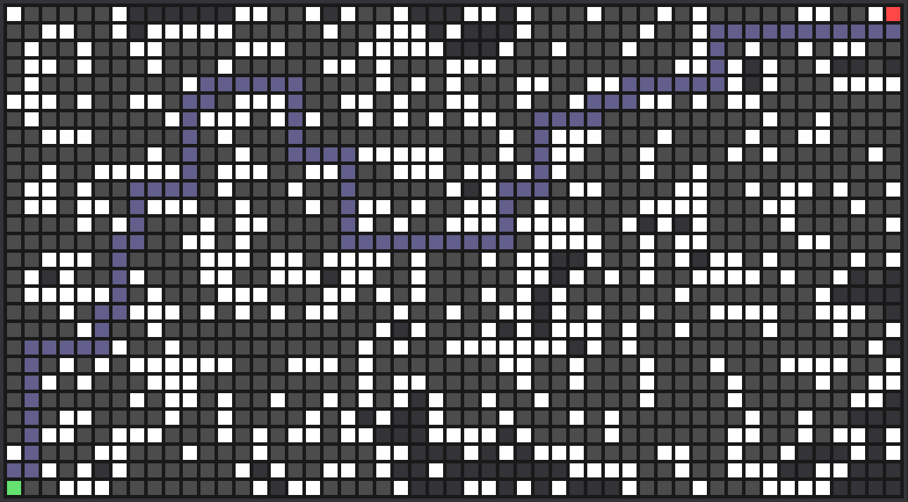

# OpenGLPathfinder



## Introduction

Yet another Dijkstra's Algorithm visualization tool. What sets this one apart, you might ask? The fact that it's written in C++ and using raw OpenGL!

Writing a pathfinding visualizer is been something I had wanted to do for a while, initially in Pygame. However, around the time I had this idea, I had been reading into using OpenGL. This seemed like a good opportunity to kill two birds with one stone.

## Getting Started
To clone:

```
git clone --recursive https://github.com/rpuhalovich/OpenGLPathfinder.git
cd OpenGLPathfinder
```

Build for Windows:

```cmake -S . -B build -G"Visual Studio 16 2019"``` or ```scripts\build_visual_studio.bat```

Build for Mac:

```cmake -S . -B build -GXcode``` or ```./scripts/build_xcode.sh```

## Usage

### Mechanics

White Square: Obstacle - cannot be traversed.

Dark Grey Square: UnVisited node.

Light Grey Square: Visited node.

Green Square: Start node.

Red Square: Finish node.

Dark Green Square: Path node.

### Controls
#### Mouse
Left Click: Toggle node between obstacle and unVisited.

Right Click: Hold down to paint obstacles.

Middle Click: Hold down to erase.

#### Keyboard
Space Bar: Begin Dijkstra's Algorithm.

1: Random blocks.

2: Recursive Backtracking Maze Algorithm (WIP).

C: Clear obstacles.

R: Reset the board.

## TODO

- This application crashes on MacOS when pressing space bar for the algorithm start (compiler differences that I need to track down).
- Some of the algorithms are not exactly the most efficient (not the point of this program but could still do with improvement). 
- Track down that pesky 32 byte memory leak on application termination.
- Others mentioned in the source code.
